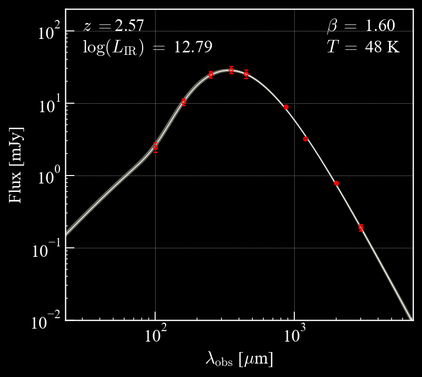
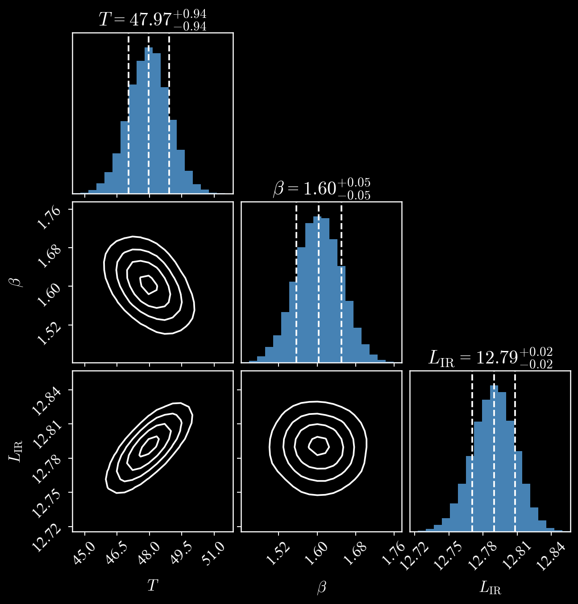

# mbb

**mbb** is an implementation of a modified blackbody (MBB) model, commonly used for fitting the spectral energy distributions (SEDs) of dusty star-forming galaxies (DSFGs) as well as other astrophysical phenomena.

Feel free to suggest updates/point out issues on the [GitHub page](https://github.com/mckay-sjm/mbb_model).

Author: Stephen McKay, 2023

## Installation

The simplest way to install `mbb` is with `pip`; e.g., `pip install mbb`.

## Usage

**mbb** can be used to generate mock SEDs based on a range of dust emission parameters, or it can be used to fit dust emission models to observed photometry and extract the best-fit parameters. The code is fully Bayesian, built with the [`emcee`](https://emcee.readthedocs.io/en/stable/) package.

Documentation and examples available [here.](https://mbb.readthedocs.io/en/latest/)

 
