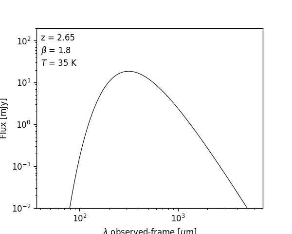
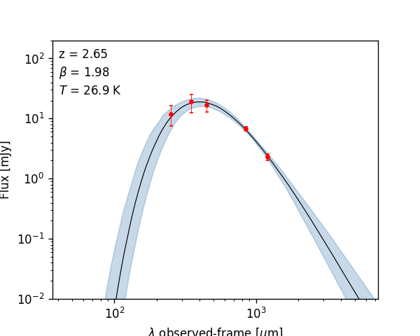
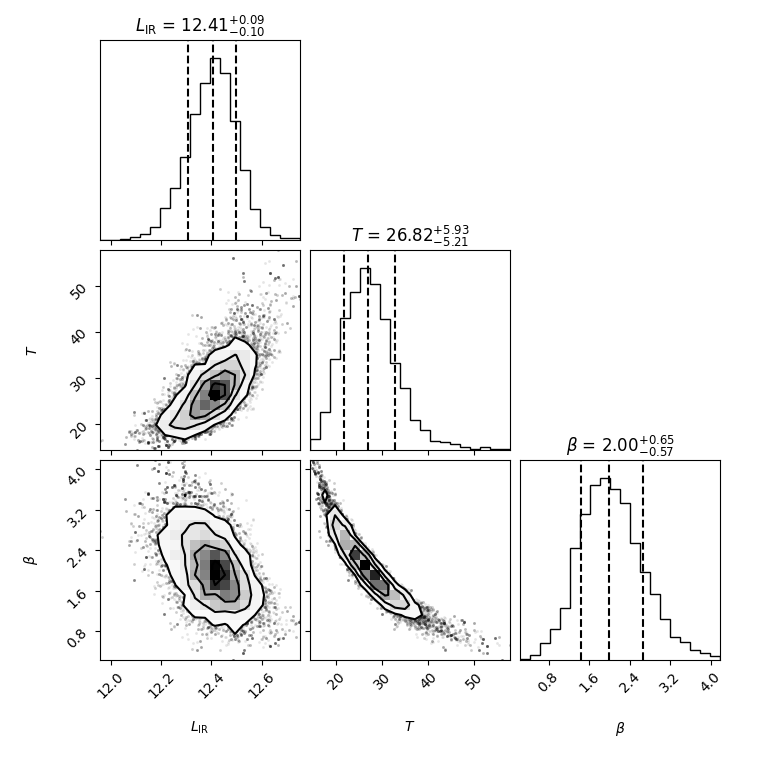

.. _quickstart:

Quickstart
========================

Once you have installed ``mbb``, import it in a python script:

.. code-block:: python

    from mbb import ModifiedBlackbody as MBB

The first step is usually to create a MBB model by filling in the necessary initial parameters: 

.. code-block:: python

    m = MBB(L=12.5, T=35, beta=1.8, z=2.65, opthin=True, pl=False)

A quick plot of this model can be made, if desired:

.. code-block:: python

    import matplotlib.pyplot as plt

    fig, ax = m.plot_sed(obs_frame=True)
    plt.show()

Fitting photometric data
------------------------

Most often, you want to fit a given model to photometric data points. ``mbb`` allows for Bayesian model fitting via the ``fit()`` method, which uses the ``emcee`` package to perform Markov Chain Monte Carlo (MCMC) sampling of the parameter space:

.. code-block:: python

    phot = (
        [250, 350, 450, 850, 1200], # wavelength in microns
        [0.012, 0.019, 0.0166, 0.00683, 0.0023], # flux in Jy
        [0.0044, 0.0064, 0.0036, 0.00057, 0.0003]  # error in Jy
        )
    result = m.fit(phot=phot, niter=500, params=['L', 'T', 'beta'], restframe=False)

.. code-block:: bash

    Running burn-in...
    100%|█████████████████████████████████████████| 300/300 [00:07<00:00, 38.87it/s]
    Running fitter...
    100%|█████████████████████████████████████████| 500/500 [00:12<00:00, 41.62it/s]
    Done 

You specify which parameters to fit using the ``params`` keyword argument; the options are ``L``, ``T``, ``beta``, ``alpha``, ``l0``, or ``z`` (the latter if you want to use ``mbb`` as a far-infrared photometric redshift code).

The parameters passed to initialize the ``ModifiedBlackbody`` are passed to ``emcee`` as the starting parameters of the fit.

View the resulting model after the fit, with uncertainties:

.. code-block:: python

    fig, ax = m.plot_sed(obs_frame=True)
    plt.show()

You can also make a simple corner plot of the parameters that were varied:

.. code-block:: python

    fig = m.plot_corner()
    plt.show()

The basic plotting routines are fairly sparse, but most plot aspects can be modified, or you can write your own functions to produce higher quality / publication-ready figures.

Modeling priors
---------------

By default, uniform priors are assumed on all the fit parameters, but you can change this by passing a dictionary, ``priors``, to ``fit``. 
Each key of ``priors`` should be the name of a parameter, and each value is either:

1. a dictionary with keywords ``mu`` and ``sigma``, to specify Gaussian priors
2. your own function, which takes the parameter as an argument and returns a number between 0.0 and 1.0.

.. code-block:: python

    result = m.fit(phot=phot, niter=500, params=['L', 'T', 'beta'], 
        restframe=False, priors = {'beta':dict(mu=1.8,sigma=0.3))

Working with the fit results
----------------------------

More coming soon!