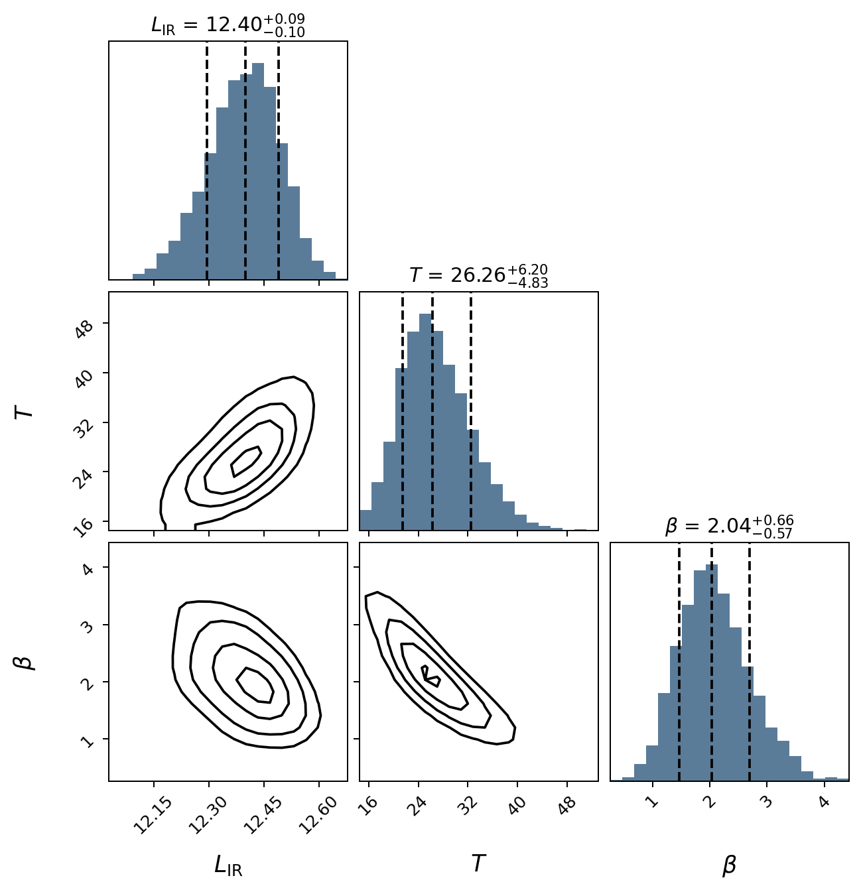

.. _quickstart:

Quickstart
========================

Once you have installed ``mbb``, import it in a python script:

.. code-block:: python

    from mbb import ModifiedBlackbody as MBB

The first step is usually to create a MBB model by filling in the necessary initial parameters: 

.. code-block:: python

    m = MBB(L=12.5, T=35, beta=1.8, z=2.65, opthin=True, pl=False)

Here we have chosen an optically thin model with no mid-infrared power law. A quick plot of this model can be made, if desired:

.. code-block:: python

    import matplotlib.pyplot as plt

    fig, ax = m.plot_sed(obs_frame=True)
    plt.show()

Alternatively, we could choose, say, a general opacity model with the power law included (default power-law slope ``alpha=2.0`` and turnover wavelength ``l0=200`` microns):

.. code-block:: python

    m2 = MBB(L=12.5, T=35, beta=1.8, z=2.65, opthin=False, pl=True)
    fig, ax = m2.plot_sed(obs_frame=True)
    plt.show()

The above model follows `Casey (2012) <https://doi.org/10.1111/j.1365-2966.2012.21455.x>`_, where the power law is joined at 3/4 the wavelength where the slope equals ``alpha``. 
If you prefer a piecewise power law connected where the slope of the blackbody matches ``alpha``, set ``pl_piecewise`` to ``True``:

.. code-block:: python

    m3 = MBB(L=12.5, T=35, beta=1.8, z=2.65, opthin=False, pl=True, pl_piecewise=True)
    fig, ax = m3.plot_sed(obs_frame=True)
    plt.show()

Fitting photometric data
------------------------

Most often, you want to fit a given model to photometric data points. ``mbb`` allows for Bayesian model fitting via the ``fit()`` method, which uses the ``emcee`` package to perform Markov Chain Monte Carlo (MCMC) sampling of the parameter space:

Note: ``mbb`` handles upper limits correctly in the Bayesian likelihood function. To specify which data should be treated as upper limits, pass a boolean array to the ``uplims``  keyword of ``fit()``. 
The code assumes that, for each photometric band labeled as an upper limit, the flux value should be used as the limit (accounting for the :math:`1\sigma` uncertainty as well) if it is positive and larger than the :math:`1\sigma` error, otherwise this error is used as the limit. 

.. code-block:: python

    import numpy as np
    phot = np.array(
	    [[250, 350, 450, 850, 1200], # wavelength in microns
	     [0.012, 0.019, 0.0166, 0.00683, 0.0023], # flux in Jy
	     [0.0044, 0.0064, 0.0036, 0.00057, 0.0003]]  # error in Jy
	    )
	uplims=phot[1]/phot[2] < 3.0 # upper limit if not detected at >= 3-sigma
	result = m.fit(phot=phot, uplims=uplims, niter=1000, params=['L', 'T', 'beta'])

.. code-block::

    Running burn-in...
    100%|█████████████████████████████████████| 1000/1000 [00:35<00:00, 27.80it/s]
    Running fitter...
    100%|█████████████████████████████████████| 1000/1000 [00:37<00:00, 26.34it/s]
    Done

You specify which parameters to fit using the ``params`` keyword argument; the options are ``L``, ``T``, ``beta``, ``alpha``, ``l0``, or ``z`` (the latter if you want to use ``mbb`` as a far-infrared photometric redshift code).
The parameter values used to initialize the ``ModifiedBlackbody`` are also used by ``emcee`` as the starting parameters of the fit.

View the resulting model after the fit, with uncertainties:

.. code-block:: python

    fig, ax = m.plot_sed(obs_frame=True)
    plt.show()

.. image:: images/ex_plt_2.png
   :width: 380px

You can also make a simple corner plot of the parameters that were varied:

.. code-block:: python

    fig = m.plot_corner()
    plt.show()

The basic plotting routines are fairly sparse, but most plot aspects can be modified, or you can write your own functions to produce higher quality / publication-ready figures.

Modeling priors
---------------

By default, uniform priors are assumed on all the fit parameters, but you can change this by passing a dictionary, ``priors``, to ``fit``. 
Each key of ``priors`` should be the name of a parameter, and each value is either:

1. a dictionary with keywords ``mu`` and ``sigma``, to specify Gaussian priors
2. your own function, which takes the parameter as an argument and returns the probability density of that parameter value.

.. code-block:: python

    result = m.fit(phot=phot, niter=1000, params=['L', 'T', 'beta'], 
        restframe=False, priors = {'beta':dict(mu=1.8,sigma=0.3)})

.. code-block::

    Running burn-in...
    100%|█████████████████████████████████████| 1000/1000 [00:36<00:00, 27.32it/s]
    Running fitter...
    100%|█████████████████████████████████████| 1000/1000 [00:36<00:00, 27.20it/s]
    Done

Accessing the fit results
-------------------------

To access the percentiles of the posterior distribution for any parameter in the fit:

.. code-block:: python

    print(m.post_percentile('beta', q=(16,50,84))) #16th, 50th, 84th percentiles

.. code-block:: python
    
    [1.63739978 1.90546219 2.17945187]

To get the reduced chi-squared value from the fit_result:

.. code-block:: python
    
    reduc_chi2 = m.fit_result['chi2'] / (m.fit_result['n_bands']-m.fit_result['n_params'])
    print(chi2)

.. code-block:: python
    
    0.8526608373363864

Currently, the measurement for ``L`` requires integration under the hood, so it can take a long time. The same applies for generating the corner plots. I'm working on speeding this process up.

The full ``emcee.EnsembleSampler`` is stored as the ``sampler`` element of the ``fit_result`` dictionary. This can be used to perform any kind of analysis one would typically want with ``emcee``, such as looking at the autocorrelation time and other fit statistics, if desired.

To clear the ``fit_result`` and priors, use ``reset()``. Note that the parameters of the MBB will still be set to the best values from the previous fit:

.. code-block:: python
    
    m.reset()
    print(np.round(m.beta,2))

.. code-block:: python
    
    1.91

Other utility functions
-----------------------

The ModifiedBlackbody class also includes a few helper functions and attributes to compute useful quantities, such as fluxes, luminosities, and dust masses:

Flux at a given wavelength:
^^^^^^^^^^^^^^^^^^^^^^^^^^^^

To get the model flux at a given wavelength, pass a value or array of wavelengths (in micron) to ``eval()``. By default, this assumes observed-frame wavelengths, 
but you can specify a rest-frame wavelength by passing ``z = 0`` (i.e., shifting the observed SED to :math:`z = 0`).

.. code-block:: python
    
    m.eval(1200) #wl in microns, observed frame by default

.. code-block:: python
    
    0.0024958420867594506 Jy

.. code-block:: python
    
    import astropy.units as u

    np.round(m.eval(100, z=0).to(u.mJy), 3) #rest frame 100um

.. code-block:: python
    
    18.438 mJy

Infrared luminosity:
^^^^^^^^^^^^^^^^^^^^

.. code-block:: python
    
    print(m.get_luminosity(wllimits=(8,1000))) #8-1000um gives same luminosity as m.L. Can choose any rest frame wavelength limits desired.
    print(np.round(np.log10(m.get_luminosity(wllimits=(8,1000)).value),2))
    print(np.round(m.L,2))

.. code-block::
    
    2499320878862.3975 solLum
    12.40
    12.40

Dust mass:
^^^^^^^^^^

.. code-block:: python
    
    np.log10(m.dust_mass.value) #solMass

.. code-block:: python
    
    8.804948529939795

Wavelength where dust emission peaks (proxy for temperature):
^^^^^^^^^^^^^^^^^^^^^^^^^^^^^^^^^^^^^^^^^^^^^^^^^^

.. code-block:: python
    
    m.get_peak_wavelength() # note this is a rest-frame wl

.. code-block:: python
    
    108.2946298908265 micron

Multiprocessing
---------------

By default, ``mbb`` will try to use the number of available CPUs minus 2 to run the fit. To control this, you can either pass an integer to the ``ncores`` argument of ``fit`` (pass 1 to not use multiprocessing at all), or you can generate your own process Pool object (e.g., ``multiprocessing.pool.Pool``) and pass it as the ``pool`` argument.

Note: to avoid multiprocessing errors, the process start method is set to "fork" on Linux/macOS and to "spawn" on Windows. If you run into errors, I recommend passing in your own Pool object or forgoing multiprocessing.
